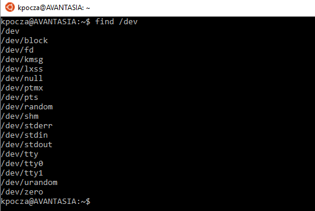

# How it works

The most common way to present graphics and sound on Linux are FrameBuffer (/dev/fb0) and ALSA (/dev/snd/controlC?, /dev/snd/pcmC?D?p, etc.).  Mouse support is exposed through devices, as well (eg. /dev/input/mice).

However WSL doesn't provide these devices at the moment:

LoWe emulates/simulates/tricks these devices while providing the most common functionalities of them. Please be aware that not all device calls are support at the moment. The most important goal of this project is to show that WSL is not as closed environment as it seems to be and it can provide more than you would expect. 

## Really? How it works?

LoWe creates the missing device files (as regular files) under /dev to let them to be opened by the program and have a file descriptor. Later on it intercepts Linux kernel system calls (syscalls) in user mode via ptrace (like strace). When LoWe thinks that she is responsible to handle given syscalls (ioctl, read, write, mmap, etc.) of particular devices identified by file descriptors then it provides her own responses to the syscalls instead of going down to the Windows kernel that has no support for those functions.

LoWe consist of two components:

1. loweagent, which runs inside WSL
2. LoWeExposer, which is a Windows application that uses Windows API calls to expose stuff

These apps communicate to each other through the NTFS file system and network sockets. LoWeExposer reserves port no. 12345 of 127.0.0.1.

## Exposing Framebuffer

The Framebuffer device (/dev/fb0) provides graphic presentation support on Linux. The device itself supports some basic ioctl calls like querying and setting graphics modes moreover presenting pixel graphics through a memory mapped area.

LoWe creates a file that is as large as the framebuffer size to fit 1280x720x32bpp image without double buffering. Then it tricks the caller to accept this graphics mode for presentation. Applications originally use mmap to map the device memory area. In this case the regular file's content will be memory mapped. ~~A Windows WPF application periodically presents the content of this file (that resides in the temp folder of WSL) in a WPF window.~~ mmap returns the address of the remote memory address from which the content is periodically copied to loweagent's local buffer via process_vm_readv on a thread. An other thread is periodically sending the content of the local buffer to LoWeExposer through a network socket that displays the graphics content in a WPF window. 

The dirty pages of mmap are still synced to /dev/fb0 due to a limitation reported here: https://github.com/Microsoft/BashOnWindows/issues/1491 . After fixing this issue further performance improvement is expected.

## Exposing ALSA

ALSA stands for Advanced Linux Sound Architecture that is responsible to break the silence of Linux. It exposes some /dev-s to provide sounds card control, mixer, MIDI, PCM, etc. functionality. Currently LoWe supports basic sound card control functions and the most important PCM (waveform) functions. LoWe provides fake answers to the sound card and PCM setup ioctl call to the program. Some of the ALSA requests are forwarded by LoWeAgent to LoWeExposer through a network socket. Which then, using the Windows sound system, plays the music and executes some audio control operations.

## Exposing TTY

Some TTY support is provided just to trick X server.

## Exposing Mouse

Mouse is exposed as /dev/input/mice in the majority of cases to Linux programs. There are multiple mouse protocols, types and message formats that Linux supports. Out of those LoWe favors ImPS2, as it's one of the simplest standards. LoWeExposer monitors the mouse movements on top of the Framebuffer window (when both enabled). LoWeagent running on the WSL side is continuously enquiring LoWeExposer through a socket connection for mouse movements and button state. It provides ImPS2 compliant responses to the caller application. Mouse support is essential to X server support.

## Exposing Keyboard

Of course WSL has keyboard input support for console applications like bash, vim, etc. However when starting an X server (of course under the supervision of LoWeagent) no keyboard input device is available. To overcome this limitation LoWe added keyboard support through /dev/input/kbd which is an unusual device name that doesn't exist in real Linuxes. X is to be configured to use this device for keyboard input while LoWeagent is continuously enquiring LoWeExposer through a socket connection for keyboard events on the Framebuffer window (key down and up events for different scancodes).

