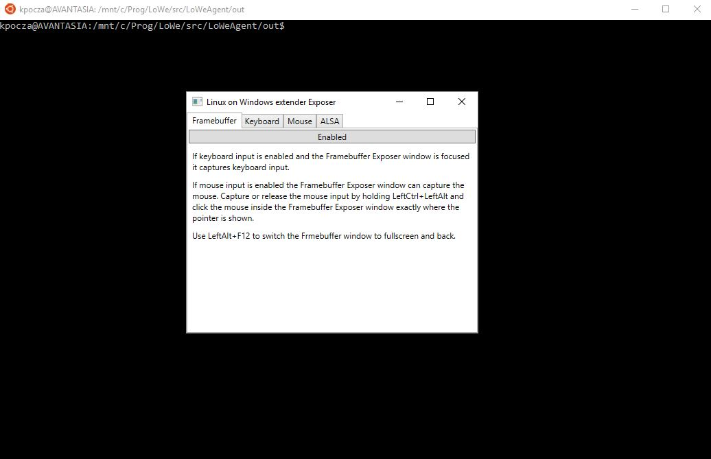
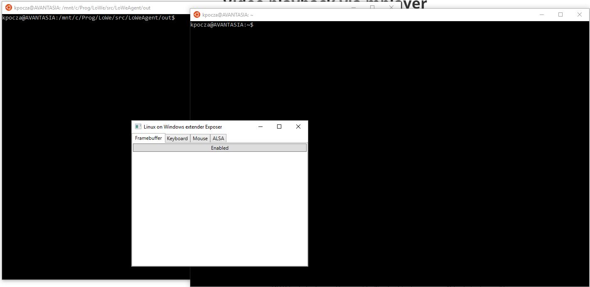

# Video playback via mplayer

It's recommended to try both simple and complex ways and once you have accustomed to the theory and story behind LoWe then stay at the simple way.

## The simple way

Please follow these steps:

1. You need to start a single Bash instance that will run the agent application that will start mpalyer itself

2. You have to start LoWeExposer in Windows

   

3. Starting ```loweagent -e "mplayer my_favourite_video.mkv" -o mplayer.log``` will do the following steps:

   1. Detect if any devices require coordination with LoWeExposer
   2. Check if all regular files that mimic the original /dev file exist
   3. If not then it creates them (as root - you will be asked for user password to sudo) and checks for their existence again 

   

   4. It will start mplayer as parameterized after the -e switch and attach to the process
   5. The ALSA tab of LoWeExposer will show the following messages:

   

   Moreover the Framebuffer Exposer window will popup.

The devices created by LoWeAgent will disappear when the WSL session ends. They have to be recreated next time.

4. Mplayer is running:


and playing video and sound


## The complex way

Please follow these steps:

1. You need to start two instances of Bash
   - The first one will run loweagent  (cd to the out folder of loweagent)
   - The second one will run the application
2. You have to start LoWeExposer in Windows



3. loweagent is not a generic application yet, so it is prepared to support some predefined applications, like mplayer. Please refer to loweagent.conf.

4. Enter ```./loweagent mplayer``` command to execute LoWeAgent in mplayer mode (it won't start mplayer itself). It will do the following actions:

   1. Detect if any devices require coordination with LoWeExposer
   2. Check if all regular files that mimic the original /dev file exist
   3. If not then it creates them (as root) and checks for their existence again 

   

   4. It will start waiting for the mplayer process to start
   5. The ALSA tab of LoWeExposer will show the following messages:


​		Moreover the Framebuffer Exposer window will popup.

The devices created by LoWeAgent will disappear when the WSL session ends. They have to be recreated next time.

Next time you may start   ```./loweagent -o mplayer.log mplayer``` to forward log messages to mplayer.log instead of stdout.

5. In the other Bash window start mplayer with some video or audio like 

```mplayer my_favourite_video.mkv  ```


It can happen that loweagent doesn't catch the mplayer process. In this case mplayer needs to be rerun (sometimes several times). In the future loweagent will have the ability to start the application and don't try to attach to a process that has been just started.

6. Playing video and sound:


