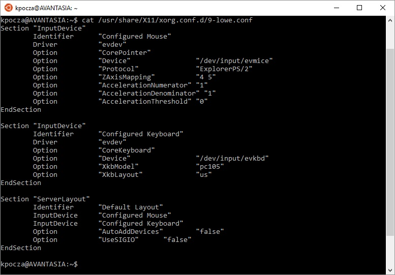
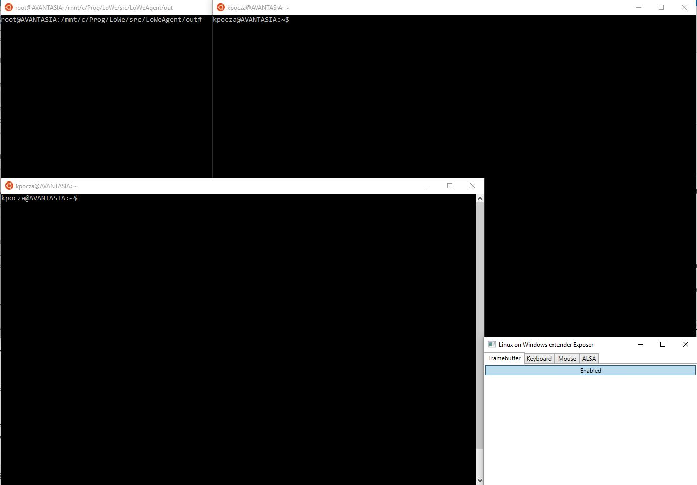
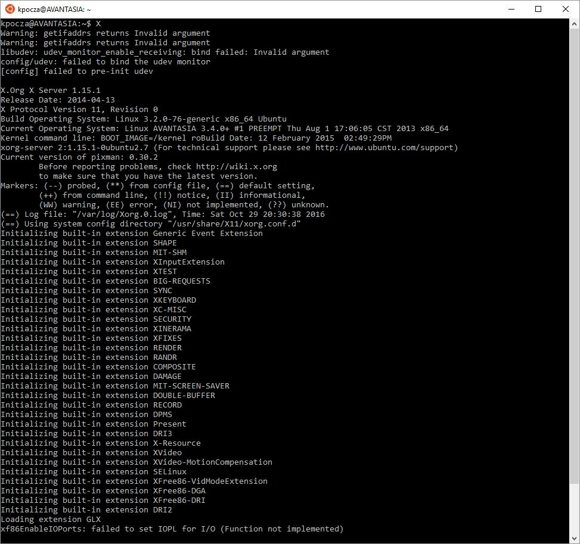

# Running graphical apps on Window Maker on X.Org

Executing X-based graphical apps is a bit circumstantial at the moment. Simplification is expected in the future.

## Prerequisites

The following additional packages are to be installed:

- xserver-xorg
- xserver-xorg-input-kbd
- wmaker

Execute

```
sudo apt install xserver-xorg
sudo apt install xserver-xorg-input-kbd
sudo apt install wmaker
```

Copy the 9-lowe.conf from the configs folder of the local git repository to ```/usr/share/X11/xorg.conf.d/9-lowe.conf```.

Install any additional packages, eg. xterm, firefox, etc.

The content of the file should look like as follows:



## Steps to follow

1. You need to start three instances of Bash
   - The first one will run loweagent (cd to the out folder of loweagent)
   - The second one will run the X server
   - The third one will run Window Maker the windowing system

   The **first one** must **switch to root** via ```sudo su```. The reason is that X is a setuid root program so that the tracer should run as root, as well.
2. You have to also start LoWeExposer



3. loweagent is not a generic application yet, so it is prepared to support some predefined applications, like mplayer or x. Please refer to loweagent.conf.

4. Enter ```./loweagent x``` command in the first Bash to execute LoWeAgent in X mode. It will do the following actions:

   1. Detect if any devices require coordination with LoWeExposer
   2. Check if all regular files that mimic the original /dev file exist
   3. If not then creates them (as root) and checks for their existence again 

   

   4. It will start waiting for the X to start.
   5. The LoWeExposer will show the FrameBuffer window, moreover Keyboard and Mouse check will also take place.

5. In the second Bash window start ```X```  or ```xinit```:



It can happen that loweagent doesn't catch the X process. In this case X needs to be rerun (sometimes several times). In the future loweagent will have the ability to start the application and don't try to attach to a process that has been just started.

6. Start Window Maker

The DISPLAY env var needs to be exported and the wmaker process is to be started:

```
export DISPLAY=:0
wmaker
```
Like this:


8. Run X programs in wmaker

   The actual GUI is presented in the Framebuffer Exposer window. If it has focus, the keyboard input is forwarded to X. To capture (and release) mouse hold the Ctrl+Alt keys and click the left mouse button on top of the mouse cursor presented in the above mentioned window.

